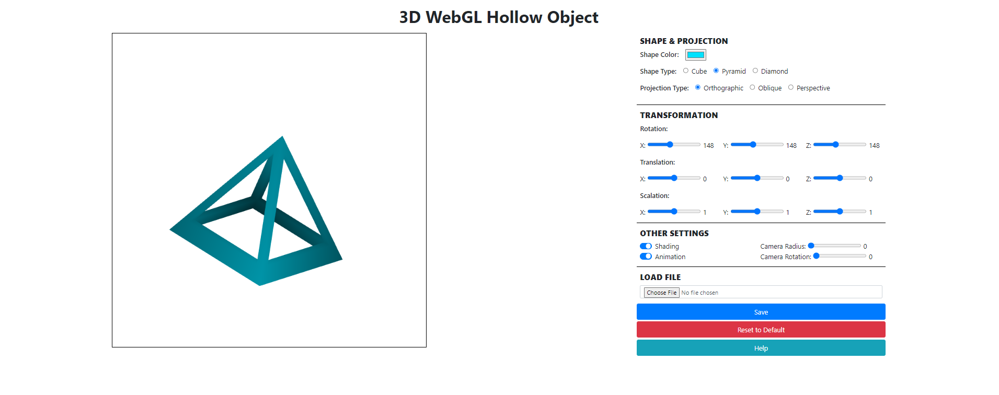

# 3D WebGL Hollow Object

## Deskripsi
WebGL Hollow Object pada JavaScript banyak digunakan dalam aplikasi web interaktif, seperti game dan simulasi 3D. Objek yang dihasilkan menggunakan WebGL memiliki keunggulan dalam hal kecepatan dan kemampuan untuk menampilkan grafik yang kompleks dan real-time.

## Bentuk Objek
- Cube
- Pyramid
- Diamond

## Hasil

## Cara Penggunaan
1. Buka `index.html` pada folder `src`.
2. Gunakan extension live server untuk menjalankan program.
3. Buka `localhost` pada browser sesuai dengan port yang digunakan.

## Kelompok
|    NIM    |          Nama          |
| :-------: | :--------------------: |
| 13520001  | Fayza Nadia            |
| 13520017  | Diky Restu Maulana     |
| 13520036  | I Gede Arya Raditya    |